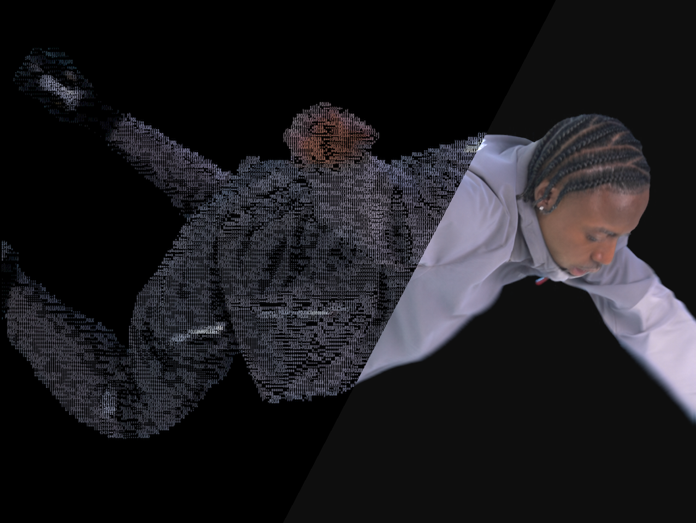
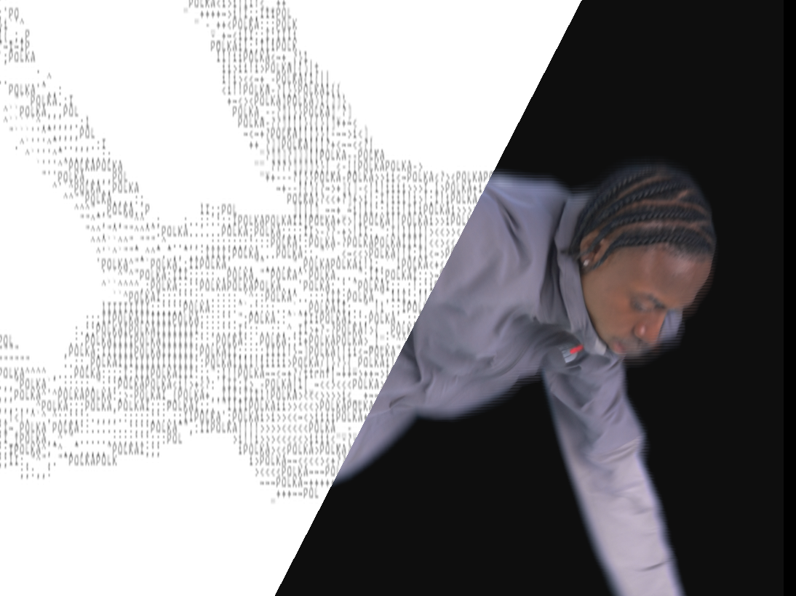

# ASCII Art Converter

Convert image sequences into ASCII art frames — CLI + GUI.
Built by [Polka Dot Post](https://github.com/harv12321).





---

## What it does

Drop a folder of PNG frames, get back a matching folder of ASCII-rendered frames at the same resolution. Supports white-on-black, black-on-white, and full-colour output — all in one pass. You can also weave custom text (like a brand name or year) through the artwork.

---

## Requirements

- **Python 3.10 or newer** — [download here](https://www.python.org/downloads/) if you don't have it
  - ⚠️ During install on Windows, tick **"Add Python to PATH"**
- **Two pip packages** — installed in the step below

---

## Setup (first time only)

Open **Terminal** (Mac/Linux) or **Command Prompt** (Windows) and run:

```
pip install Pillow numpy
```

That's all the setup you need.

---

## Running the GUI

Double-click `ascii_converter_gui.py`, or run:

```
python ascii_converter_gui.py
```

A window will open. From there:
1. Click **Browse** and select a folder containing PNG frames
2. Adjust any settings (cell size, custom strings, output style, etc.)
3. Click **▶ Convert**
4. Your ASCII frames will appear in an `ascii_output/` folder inside the folder you selected

---

## Running from the command line

```
python ascii_converter_2.py /path/to/your/png/folder
```

Results are saved to `ascii_output/` inside that folder, with a subfolder per style (`white_on_black/`, `black_on_white/`, `colour/`).

---

## Downloading the files

Click the green **Code** button at the top of this page → **Download ZIP**, then unzip it anywhere on your computer.

Or if you use git:

```
git clone https://github.com/harv12321/ascii-art-converter.git
```

---

## Settings

| Setting | Default | What it does |
|---|---|---|
| Cell W / Cell H | 6 / 12 | Source pixels per ASCII character. Keep H ≈ 2×W. |
| Font size | 12pt | Size of the monospace font in the output image. |
| Custom strings | BRAND, PDP, ASCII, 2026 | Text scattered intact through the subject area. |
| Density | 0.5 | 0 = only ramp chars, 1 = only your custom strings. |
| Style | all | `white_on_black`, `black_on_white`, `colour`, `both`, or `all`. |
| Alpha threshold | 30 | Cells below this alpha are treated as background. |
| Premultiplied alpha | on | Turn off if your PNGs have no real alpha channel. |

---

## Live site

**[→ harv12321.github.io/ascii-art-converter](https://harv12321.github.io/ascii-art-converter)**

---
